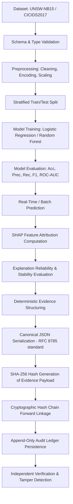

# SentinelCrypt AI — Master System Specification & Architecture Blueprint

**Document Version:** 1.0.0  
**Classification:** Core System Architecture & Research Protocol  
**Status:** Frozen / Active Source of Truth  
**Target Domain:** Verifiable Machine Learning & Cryptographic Audit Ledger for Intrusion Detection Systems (IDS)

---

## 1. Executive Summary & Core Identity

**SentinelCrypt AI** is a verifiable, explainable, and cryptographically auditable Machine Learning framework for Network Intrusion Detection Systems (NIDS).

Unlike conventional intrusion detection systems that function as opaque black boxes or simple prediction APIs, SentinelCrypt AI establishes an end-to-end **Verifiable AI Pipeline**:
1. **Detects** malicious network traffic using reproducible, interpretable baseline and ensemble ML models (Logistic Regression, Random Forest).
2. **Explains** every classification decision locally and globally via SHAP (SHapley Additive exPlanations) and quantifies explanation reliability under input perturbation.
3. **Evidences** every inference by generating canonical deterministic JSON payloads containing the sample features, model version, prediction probabilities, and explanation vectors.
4. **Anchors** inference records into an immutable, forward-linked **SHA-256 Cryptographic Hash Chain** (Audit Ledger).
5. **Verifies** ledger integrity and tamper resistance through mathematical verification routines and automated tamper-detection simulations.

> **CRITICAL ARCHITECTURAL DIRECTIVE:**  
> SentinelCrypt AI is **NOT** a blockchain. It does not use consensus mechanisms, proof-of-work, mining, peer-to-peer gossip networks, or smart contracts. It is an append-only, tamper-evident cryptographic hash chain running over structured relational storage.

---

## 2. System Architecture & Dependency Direction

The system enforces strict unidirectional layer dependencies. High-level modules depend on domain abstractions; infrastructure details depend on domain models.

```
                 ┌─────────────────────────────────────────┐
                 │          React 18 + Vite UI             │
                 └────────────────────┬────────────────────┘
                                      │  (HTTP / JSON REST)
                                      ▼
                 ┌─────────────────────────────────────────┐
                 │            FastAPI v1 API               │
                 └────────────────────┬────────────────────┘
                                      │  (Dependency Injection)
             ┌────────────────────────┼────────────────────────┐
             ▼                        ▼                        ▼
       ┌───────────┐            ┌───────────┐            ┌─────────────┐
       │ ML Engine │            │XAI Engine │            │Cryptography │
       │ (backend/ │            │ (backend/ │            │   Engine    │
       │  app/ml)  │            │  app/xai) │            │ (backend/   │
       └─────┬─────┘            └─────┬─────┘            │app/crypto)  │
             │                        │                  └──────┬──────┘
             └────────────────────────┼─────────────────────────┘
                                      ▼
                        ┌───────────────────────────┐
                        │     Services Layer        │
                        │   (backend/app/services)  │
                        └─────────────┬─────────────┘
                                      ▼
                        ┌───────────────────────────┐
                        │     Repository Layer      │
                        │ (backend/app/db/repos)    │
                        └─────────────┬─────────────┘
                                      ▼
                        ┌───────────────────────────┐
                        │   Database Engine (ORM)   │
                        │    (SQLite / Postgres)    │
                        └───────────────────────────┘
```

### 2.1 Layer Isolation Rules

| Layer | Path | Allowed Dependencies | Prohibited Dependencies |
|---|---|---|---|
| **ML Engine** | `backend/app/ml/` | `numpy`, `pandas`, `scikit-learn`, `scipy` | HTTP, FastAPI, SQLAlchemy, React, Cryptography |
| **XAI Engine** | `backend/app/xai/` | `shap`, `numpy`, `pandas`, `backend/app/ml/` | HTTP, FastAPI, SQLAlchemy, React, Cryptography |
| **Cryptography** | `backend/app/cryptography/` | `hashlib`, `json`, `datetime` | HTTP, FastAPI, SQLAlchemy, ML Engine, XAI Engine |
| **Services Layer** | `backend/app/services/` | ML, XAI, Crypto, Repositories, Schemas | HTTP Requests/Responses (`Request`, `Response`, `HTML`) |
| **API Layer** | `backend/app/api/` | Services, Schemas, FastAPI primitives | Direct DB SQL queries, raw model fitting, raw hashing |
| **Repository** | `backend/app/db/repositories/`| SQLAlchemy `Session`, DB Models, Schemas | FastAPI, ML Fitting, SHAP routines, UI |
| **Frontend** | `frontend/src/` | REST API via fetch/axios, React ecosystem | Direct backend imports, filesystem access |

---

## 3. The Golden Path Research Pipeline

Every operational cycle in SentinelCrypt AI follows the deterministic **Golden Path**:



---

## 4. Module Responsibilities & Boundary Definitions

### 4.1 `backend/app/ml/` (Machine Learning Engine)
- **Zero Framework Leakage:** Independent of web and database frameworks.
- **Preprocessing Pipelines:** Deterministic imputation, standard/robust scaling, one-hot/label encoding with persistent state artifacts (`scalers.py`, `encoders.py`, `pipeline.py`).
- **Model Implementations:** Base class interface `BaseModelWrapper` (`models/base.py`) providing unified `.fit()`, `.predict()`, `.predict_proba()`, `.save()`, and `.load()` APIs for:
  - `LogisticRegressionModel` (`models/logistic_regression.py`)
  - `RandomForestModel` (`models/random_forest.py`)
- **Evaluation Engine:** Metric calculation (Accuracy, Precision, Recall, F1-Score, Specificity, ROC-AUC, PR-AUC, Confusion Matrix, Brier Score) in `evaluation/metrics.py` and `evaluation/evaluator.py`.
- **Model Registry:** In-memory and disk registry managing trained model instances and active production checkpoints (`registry.py`).

### 4.2 `backend/app/xai/` (Explainable AI Engine)
- **SHAP Explanation:** Compute local feature attributions using `TreeExplainer` (for Random Forest) and `LinearExplainer` / `KernelExplainer` (for Logistic Regression) in `shap_explainer.py`.
- **Explanation Metrics:** Explanation completeness, sparsity, monotonicity, and top-$k$ feature agreement in `explanation_metrics.py`.
- **Stability Analysis:** Measure local Lipschitz continuity and sensitivity under Gaussian feature perturbation:
  $$S(x, \epsilon) = \frac{\|\phi(x) - \phi(x + \delta)\|_2}{\|\delta\|_2} \quad \text{where } \delta \sim \mathcal{N}(0, \sigma^2)$$

### 4.3 `backend/app/cryptography/` (Cryptographic Audit Engine)
- **Canonicalization (`canonicalization.py`):** Deterministic serialization of JSON objects (sorted keys, no extraneous whitespace, standardized float precision, ISO-8601 UTC timestamps) adhering to RFC 8785 / JCS principles.
- **Hashing (`hashing.py`):** Standardized SHA-256 hashing producing 64-character lowercase hexadecimal digests.
- **Hash Chain (`hash_chain.py`):** Append-only linked structure where record $i$ computes:
  $$\text{PayloadHash}_i = \text{SHA256}(\text{Canonicalize}(\text{Payload}_i))$$
  $$\text{RecordHash}_i = \text{SHA256}(\text{PreviousHash}_{i} + \text{PayloadHash}_i + \text{Timestamp}_i)$$
  Genesis record has $\text{PreviousHash}_0 = \text{"0" * 64}$.
- **Verification (`verifier.py`):** Sequential recalculation of all hash links from genesis to head, pinpointing exact block indices of any data corruption or tampering.

### 4.4 `backend/app/services/` (Orchestration Layer)
- **`PredictionService`:** Coordinates feature preprocessing $\to$ ML inference $\to$ XAI generation $\to$ Evidence packaging $\to$ Audit service persistence.
- **`TrainingService`:** Ingests dataset $\to$ executes pipeline $\to$ trains model $\to$ computes evaluation metrics $\to$ registers model.
- **`VerificationService`:** Triggers full ledger verification, generates integrity certificates, and runs controlled tamper-detection stress tests.
- **`ExperimentService`:** Orchestrates research experiments (EXP-A through EXP-D), captures reproducible telemetry, and writes artifacts to `results/`.

### 4.5 `backend/app/api/` (HTTP Interface Layer)
- FastAPI routers strictly parse request payloads into Pydantic models, inject service dependencies via `Depends()`, and return standardized HTTP responses. No business or ML logic resides in routes.

### 4.6 `experiments/` (Research Sandbox)
- Standalone, reproducible Python runners with explicit YAML configurations and isolated result sinks for academic evaluation.

---

## 5. Database Schema & Entity Relational Model

```
 ┌──────────────────────┐
 │       Dataset        │
 ├──────────────────────┤
 │ id (PK, UUID)        │
 │ name (String)        │
 │ source_file (String) │
 │ row_count (Integer)  │
 │ feature_count (Int)  │
 │ target_column (Str)  │
 │ checksum_sha256 (Str)│
 │ created_at (DateTime)│
 └──────────┬───────────┘
            │ 1:N
            ▼
 ┌──────────────────────┐
 │        Model         │
 ├──────────────────────┤
 │ id (PK, UUID)        │
 │ dataset_id (FK)      │
 │ model_type (String)  │
 │ hyperparameters(JSON)│
 │ status (String)      │
 │ artifact_path (Str)  │
 │ metrics (JSON)       │
 │ created_at (DateTime)│
 └──────────┬───────────┘
            │ 1:N
            ▼
 ┌──────────────────────────────────────────────┐
 │                  Prediction                  │
 ├──────────────────────────────────────────────┤
 │ id (PK, UUID)                                │
 │ model_id (FK)                                │
 │ input_features (JSON)                        │
 │ prediction_label (Integer)                   │
 │ prediction_probability (Float)               │
 │ latency_ms (Float)                           │
 │ created_at (DateTime)                        │
 └──────┬────────────────────────────────┬──────┘
        │ 1:0..1                         │ 1:1
        ▼                                ▼
 ┌───────────────────────────┐    ┌───────────────────────────┐
 │        Explanation        │    │        AuditRecord        │
 ├───────────────────────────┤    ├───────────────────────────┤
 │ id (PK, UUID)             │    │ id (PK, UUID)             │
 │ prediction_id (FK, Unique)│    │ prediction_id (FK, Unique)│
 │ method (String: SHAP)     │    │ sequence_number (BigInt)  │
 │ base_value (Float)        │    │ previous_hash (String 64) │
 │ feature_attributions(JSON)│    │ payload_hash (String 64)  │
 │ stability_score (Float)   │    │ record_hash (String 64)   │
 │ created_at (DateTime)     │    │ canonical_payload (Text)  │
 └───────────────────────────┘    │ created_at (DateTime)     │
                                  └───────────────────────────┘

 ┌──────────────────────┐
 │      Experiment      │
 ├──────────────────────┤
 │ id (PK, UUID)        │
 │ code (e.g. EXP-A)    │
 │ name (String)        │
 │ description (Text)   │
 │ config (JSON)        │
 │ status (String)      │
 │ created_at (DateTime)│
 └──────────┬───────────┘
            │ 1:N
            ▼
 ┌──────────────────────────┐
 │     ModelEvaluation      │
 ├──────────────────────────┤
 │ id (PK, UUID)            │
 │ experiment_id (FK)       │
 │ model_id (FK)            │
 │ dataset_id (FK)          │
 │ metrics (JSON)           │
 │ confusion_matrix (JSON)  │
 │ execution_time_s (Float) │
 │ created_at (DateTime)    │
 └──────────────────────────┘
```

---

## 6. Formal Cryptographic Hash Chain Protocol

The audit ledger guarantees **tamper evidence** and **non-repudiation** through strict mathematical linkage:

### Step 1: Canonical Payload Generation
The inference evidence packet $\mathcal{E}$ is formatted as a standardized dictionary:
```json
{
  "prediction_id": "9b1deb4d-3b7d-4bad-9bdd-2b0d7b3dcb6d",
  "model_id": "4a1c5b8e-1f2a-4c9d-8e7a-3f4b5c6d7e8f",
  "model_version": "random_forest_v1.0.0",
  "timestamp": "2026-09-20T10:30:00.000000Z",
  "input_features": {
    "dur": 0.000011,
    "proto": "udp",
    "service": "dns",
    "state": "INT",
    "spkts": 2,
    "dpkts": 0,
    "sbytes": 146,
    "dbytes": 0
  },
  "prediction": {
    "label": 1,
    "class_name": "Generic Attack",
    "probability": 0.9842
  },
  "explanation": {
    "method": "TreeSHAP",
    "base_value": 0.3200,
    "top_contributions": [
      {"feature": "sbytes", "value": 146, "shap_value": 0.412},
      {"feature": "state_INT", "value": 1.0, "shap_value": 0.252}
    ],
    "stability_score": 0.0142
  }
}
```

### Step 2: Canonical Byte Serialization
$$\mathcal{B}_{\text{payload}} = \text{UTF8}(\text{JSON.stringify}(\mathcal{E}, \text{sort\_keys}=\text{True}, \text{separators}=(',', ':')))$$

### Step 3: Payload Digest
$$\text{PayloadHash}_i = \text{SHA256}(\mathcal{B}_{\text{payload}})$$

### Step 4: Record Digest Linkage
$$\text{RecordHash}_i = \text{SHA256}\left(\text{PreviousHash}_{i} \,\|\, \text{PayloadHash}_i \,\|\, \text{Timestamp}_i \,\|\, \text{SequenceNumber}_i\right)$$
For $i = 1$ (Genesis block), $\text{PreviousHash}_1 = \texttt{0000000000000000000000000000000000000000000000000000000000000000}$.

### Step 5: Ledger Verification Algorithm
$$\forall k \in [1, N]: \quad \text{Check } \text{PreviousHash}_k \stackrel{?}{=} \text{RecordHash}_{k-1} \quad \wedge \quad \text{Check } \text{RecordHash}_k \stackrel{?}{=} \text{ComputeRecordHash}(k)$$
Any inequality at index $k$ immediately proves data tampering at or before record $k$.

---

## 7. Versioned REST API Specifications (`/api/v1`)

| Method | Endpoint | Description | Request Body | Response Status |
|---|---|---|---|---|
| `GET` | `/api/v1/health` | Service health & engine status | None | `200 OK` |
| `POST` | `/api/v1/datasets` | Register & validate new dataset | `DatasetCreate` | `201 Created` |
| `GET` | `/api/v1/datasets` | List registered datasets | Query filters | `200 OK` |
| `GET` | `/api/v1/datasets/{dataset_id}` | Retrieve dataset details & schema | None | `200 OK` |
| `POST` | `/api/v1/models/train` | Trigger training on dataset | `ModelTrainRequest` | `202 Accepted` |
| `GET` | `/api/v1/models` | List all trained models | Query filters | `200 OK` |
| `GET` | `/api/v1/models/{model_id}` | Retrieve model details | None | `200 OK` |
| `GET` | `/api/v1/models/{model_id}/metrics` | Retrieve evaluation metrics & matrices | None | `200 OK` |
| `POST` | `/api/v1/predictions` | Make real-time inference + XAI + Audit | `PredictionRequest` | `200 OK` |
| `POST` | `/api/v1/predictions/batch` | Batch inference + Chained audit | `BatchPredictionRequest` | `200 OK` |
| `GET` | `/api/v1/predictions/{prediction_id}` | Retrieve prediction details | None | `200 OK` |
| `GET` | `/api/v1/predictions/{prediction_id}/explanation` | Get SHAP explanation & stability | None | `200 OK` |
| `GET` | `/api/v1/audit/records` | Query immutable audit ledger | Pagination params | `200 OK` |
| `GET` | `/api/v1/audit/records/{record_id}` | Retrieve cryptographic audit proof | None | `200 OK` |
| `POST` | `/api/v1/audit/verify` | Verify ledger integrity & detect tampering | `VerifyRequest` | `200 OK` |
| `POST` | `/api/v1/experiments` | Trigger research experiment | `ExperimentRunRequest`| `202 Accepted` |
| `GET` | `/api/v1/experiments` | List research experiments | None | `200 OK` |
| `GET` | `/api/v1/experiments/{experiment_id}`| Get experiment results & metrics | None | `200 OK` |

---

## 8. Research Experiments Specification

| Experiment ID | Title | Objective | Key Metrics / Artifacts |
|---|---|---|---|
| **EXP-A** | Cross-Dataset Generalization | Train on UNSW-NB15, evaluate on out-of-distribution network samples (CICIDS2017) to measure domain transfer drop. | F1-Score Degradation ($\Delta F_1$), ROC-AUC drop, Domain Divergence Score. |
| **EXP-B** | Explanation Stability & Fidelity | Measure SHAP explanation variance under controlled feature perturbations ($\epsilon$-noise injection). | Local Lipschitz constant, Top-$k$ Feature Jaccard Similarity, Monotonicity score. |
| **EXP-C** | Ledger Integrity & Tamper Resistance | Execute synthetic byte modifications on historical database records and verify 100% tamper detection rate. | Tamper Detection Rate ($100\%$), False Positive Rate ($0\%$), Verification Latency vs. Chain Length $N$. |
| **EXP-D** | Model Comparison & Complexity Trade-offs | Systematic benchmark of Logistic Regression vs. Random Forest across classification accuracy, inference latency, and explanation computation time. | Accuracy, F1, Latency per sample (ms), SHAP compute time (ms), Model memory footprint (MB). |

---

## 9. Phased Development Roadmap

```
  ┌────────────────────────────────────────────────────────┐
  │ PHASE 1: Core Foundation                               │
  │ • Environment configuration, DB connection, Repos      │
  │ • Dataset ingestion, schema validation & checksums     │
  └───────────────────────────┬────────────────────────────┘
                              ▼
  ┌────────────────────────────────────────────────────────┐
  │ PHASE 2: Machine Learning Engine                       │
  │ • Preprocessing pipelines (encoders, scalers)          │
  │ • Logistic Regression & Random Forest implementations  │
  │ • Comprehensive metrics evaluator & Model Registry     │
  └───────────────────────────┬────────────────────────────┘
                              ▼
  ┌────────────────────────────────────────────────────────┐
  │ PHASE 3: Prediction & Business Services                │
  │ • PredictionService orchestration                      │
  │ • Real-time & batch prediction endpoints               │
  │ • ORM persistence of predictions                       │
  └───────────────────────────┬────────────────────────────┘
                              ▼
  ┌────────────────────────────────────────────────────────┐
  │ PHASE 4: Cryptographic Audit Engine                    │
  │ • Canonical JSON serializer & SHA-256 hash calculator  │
  │ • Hash chain forward-linkage ledger service            │
  │ • Verification engine & synthetic tamper-attack tests  │
  └───────────────────────────┬────────────────────────────┘
                              ▼
  ┌────────────────────────────────────────────────────────┐
  │ PHASE 5: Explainable AI (XAI) Engine                   │
  │ • SHAP explainer integration (TreeSHAP & LinearSHAP)   │
  │ • Explanation stability evaluator (perturbation test)  │
  │ • XAI API endpoints & Evidence packaging               │
  └───────────────────────────┬────────────────────────────┘
                              ▼
  ┌────────────────────────────────────────────────────────┐
  │ PHASE 6: Frontend Interface (React 18 + Vite)          │
  │ • Cyber-themed dark mode UI with modern glassmorphism  │
  │ • Dashboard, Datasets, Models, Predictions, XAI, Audit │
  │ • Live ledger verification interactive console         │
  └───────────────────────────┬────────────────────────────┘
                              ▼
  ┌────────────────────────────────────────────────────────┐
  │ PHASE 7: Research Experiments & Publications           │
  │ • Reproducible runners for EXP-A, EXP-B, EXP-C, EXP-D  │
  │ • Automated report & figure generation in results/     │
  └────────────────────────────────────────────────────────┘
```

---

## 10. Rules for Coding Agents & Developers ("Vibe Coding Rules")

1. **Strict Dependency Direction:** Never import outer layers (API, UI, ORM) inside inner domain logic (`ml/`, `xai/`, `cryptography/`).
2. **Determinism Above All:** All ML splits, seeds, SHAP calculations, and cryptographic serializations must be fully deterministic (`random_state=42`).
3. **No Phantom Terms:** Never refer to the hash chain as "blockchain", "mining", "consensus", or "crypto coins". It is a **Cryptographic Audit Ledger**.
4. **Zero Unverified Commits:** All raw binaries (`.pkl`, `.joblib`, `.parquet`, `.csv` datasets) must stay in `.gitignore`. Only commit code, tests, schemas, configs, and markdown docs.
5. **Fail Loudly on Tampering:** The verification engine must raise explicit `IntegrityVerificationError` with the corrupted record index whenever any hash mismatch occurs.
